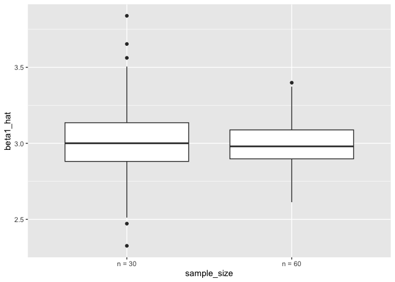
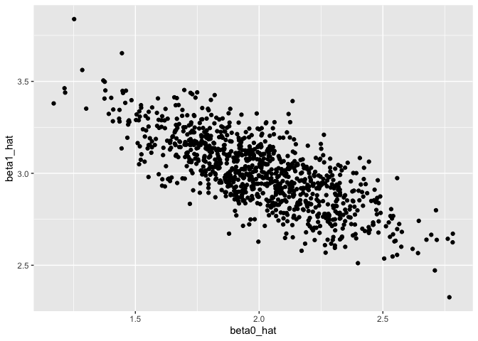

Simulation
================
My An Huynh
2024-10-31

Set seed to get exactly the same number everytime you run a simulation.
Coding a simulation simulations are natural in the context of
iteration - Write a function (or functions) to - Define data generating
mechanism - Draw a sample - Analyze the sample - Return object of
interest Use a loop/loop function to repeat many times

## Writing a simulation function

``` r
sim_data = 
  tibble(
    x = rnorm(30, mean = 10, sd = 5)
)

sim_data |> 
  summarize(
    mu_hat = mean(x),
    sigma_hat = sd(x)
  )
```

    ## # A tibble: 1 × 2
    ##   mu_hat sigma_hat
    ##    <dbl>     <dbl>
    ## 1   10.1      4.75

``` r
sim_mean_sd = function(samp_size, true_mean = 10, true_sd = 5) {
  sim_df = 
    tibble(
      x = rnorm(samp_size, true_mean, true_sd)
    )
  out_df = 
    sim_df |> 
    summarize(
      mean = mean(x),
      sd = sd(x)
    )
  
  return(out_df)
}

sim_mean_sd(samp_size = 30, true_mean = 4, true_sd = 12)
```

    ## # A tibble: 1 × 2
    ##    mean    sd
    ##   <dbl> <dbl>
    ## 1 -2.29  11.2

Run this a lot of times

``` r
sim_mean_sd(30)
```

    ## # A tibble: 1 × 2
    ##    mean    sd
    ##   <dbl> <dbl>
    ## 1  11.0  4.93

Run this using a for loop. The inputs here do not depend on i. Run
sim_mean_sd with samp size 30 1000 times to get sample mean and sd.

``` r
output = vector("list", 1000)

for (i in 1:1000) {
  output[[i]] = sim_mean_sd(30)
}

bind_rows(output) |> 
  summarize(
    ave_samp_mean = mean(mean),
    SE_samp_mean = sd(mean)
  )
```

    ## # A tibble: 1 × 2
    ##   ave_samp_mean SE_samp_mean
    ##           <dbl>        <dbl>
    ## 1          9.94        0.920

Can I use map instead Create a df that holds on the simulation results

``` r
sim_res = 
  tibble(
    iter = 1:1000
  ) |> 
  mutate(
    samp_res = map(iter, ~sim_mean_sd(samp_size = 30))
  ) |> 
  unnest(samp_res)
```

Could I try different sample sizes? The expand grid functon gives a df
of 4000 rows, 1000 iters for each sample size

sim_mean_sd doesn’t have the default value. It is a function. We map
across different values of n while applying the function sim_mean_sd.
The default parameters to this function are samp_size, true_mean and
true_sd. If we want to overwrite the true_mean value (i.e true_mean =
50), we can create an anonymous function inside of map (x) to specify
that inside the sim_mean_sd function, the true mean is 50.

``` r
sim_res = 
  expand_grid(
    n = c(10, 30, 60, 100),
    iter = 1:1000
  ) |> 
  mutate(samp_res = map(n, \(x)sim_mean_sd(x, true_mean = 50)) )  |> 
  unnest(samp_res)
```

Does anythign change when we look at different sample sizes? Empirical
verification of what we would expect to see.

``` r
sim_res |> 
  group_by(n) |> 
  summarize(
    se = sd(mean)
  )
```

    ## # A tibble: 4 × 2
    ##       n    se
    ##   <dbl> <dbl>
    ## 1    10 1.61 
    ## 2    30 0.927
    ## 3    60 0.642
    ## 4   100 0.496

We can also visualize parts of this

``` r
sim_res |> 
  mutate(
    n = str_c("n = ", n),
    n = fct_inorder(n)
  ) |> 
  ggplot(aes(x = n, y = mean)) +
  geom_violin()
```

<!-- -->

## SLR

``` r
sim_data = 
  tibble(
    x = rnorm(30, mean = 1, sd = 1),
    y = 2 + 3 * x + rnorm(30,0,1)
  )

lm_fit = lm(y ~ x, data = sim_data)

sim_data |> 
  ggplot(aes(x = x, y = y)) + 
  geom_point()+
  stat_smooth(method = "lm")
```

    ## `geom_smooth()` using formula = 'y ~ x'

<!-- -->

``` r
sim_regression = function(n) {
  sim_data = 
    tibble(
      x = rnorm(n, mean = 1, sd = 1),
      y = 2 + 3 * x + rnorm(n,0,1)
    )

  lm_fit = lm(y ~ x, data = sim_data)

  out_df = 
    tibble(
      beta0_hat = coef(lm_fit)[1],
      beta1_hat = coef(lm_fit)[2]
    )

  return(out_df)
}
```

``` r
sim_res = 
  expand_grid(
    sample_size = c(30,60),
    iter = 1:1000
  ) |> 
  mutate(lm_res = map(sample_size, sim_regression)) |> 
  unnest(lm_res)

sim_res |> 
  mutate(sample_size = str_c("n = ", sample_size)) |> 
  ggplot(aes(x = sample_size, y = beta1_hat)) +
  geom_boxplot()
```

<!-- -->

Make a plot with beta0_hat on x and beta1 on y. See if there is any
correlation. Turns out there is.

``` r
sim_res |> 
  filter(sample_size == 30) |> 
  ggplot(aes(x = beta0_hat, y = beta1_hat)) +
  geom_point()
```

<!-- -->

## Birthday problem

Let’s put people in a room. Replace = TRUE mean more than 1 person can
have the same birthday

``` r
bday_sim = function(n) {

  bdays = sample(1:365, size = n, replace = TRUE)

  duplicate = length(unique(bdays)) < n
  
  return(duplicate)

}


bday_sim(50)
```

    ## [1] TRUE

run this a lot

``` r
sim_res = 
  expand_grid(
    n = 2:50,
    iter = 1:10000
  ) |> 
  mutate(result = map_lgl(n, bday_sim)) |> 
  group_by(n) |> 
  summarize(prob = mean(result))

sim_res |> 
  ggplot(aes(x = n, y = prob))+
  geom_line()
```

<!-- -->

We can see that for n = 30, there are more trues than n = 10
